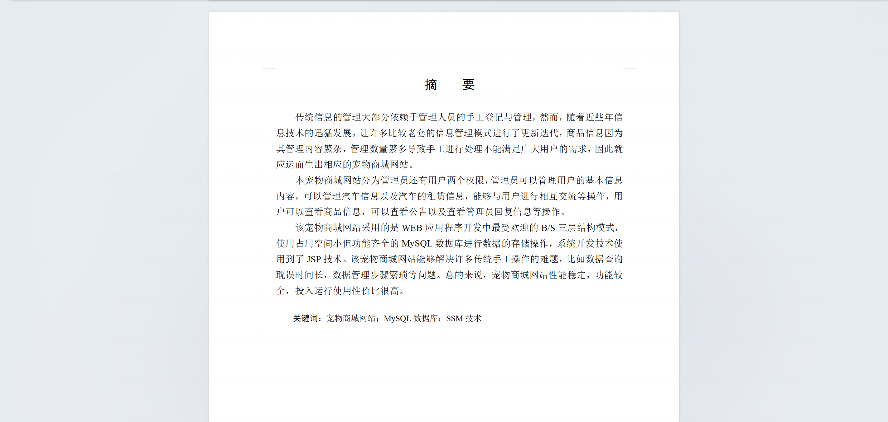
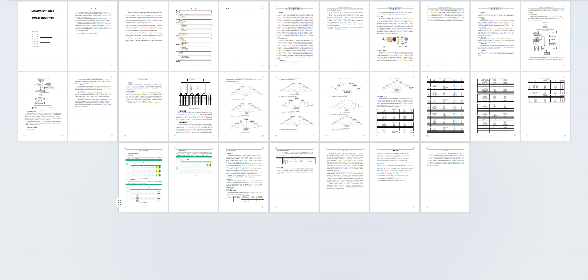
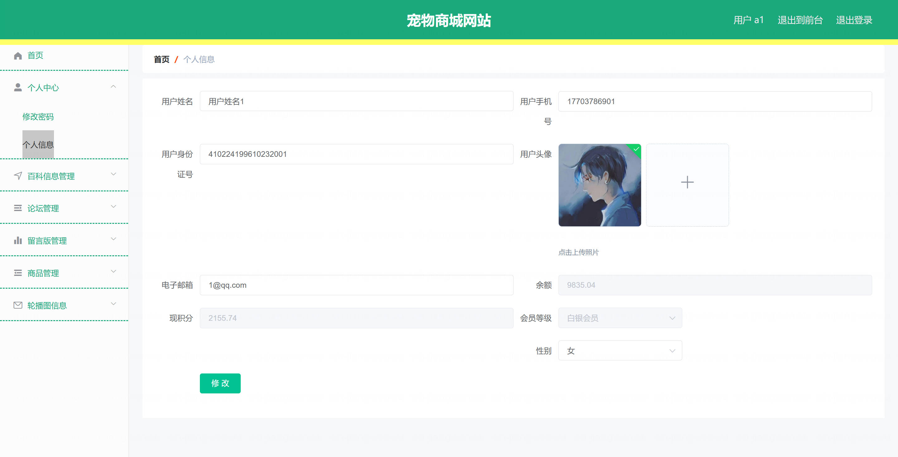
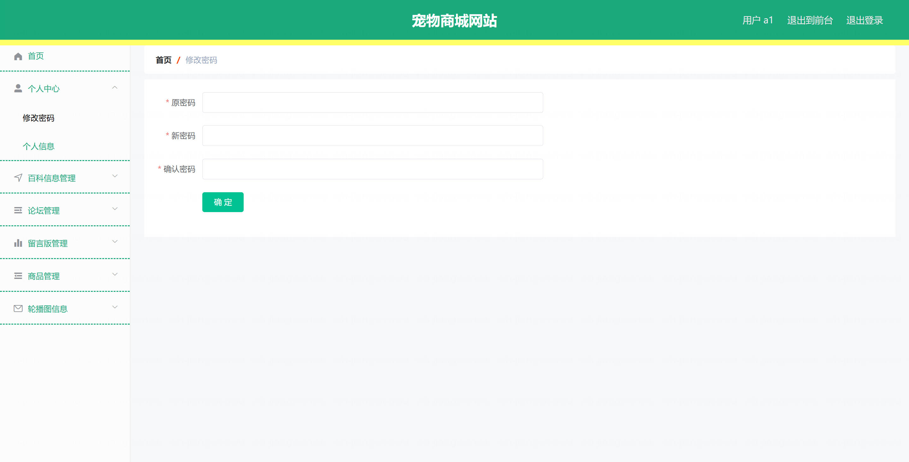
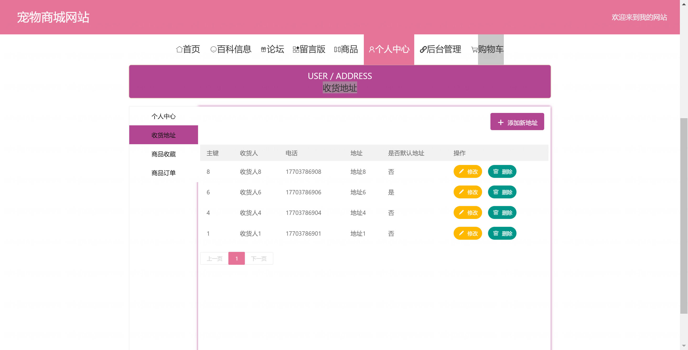
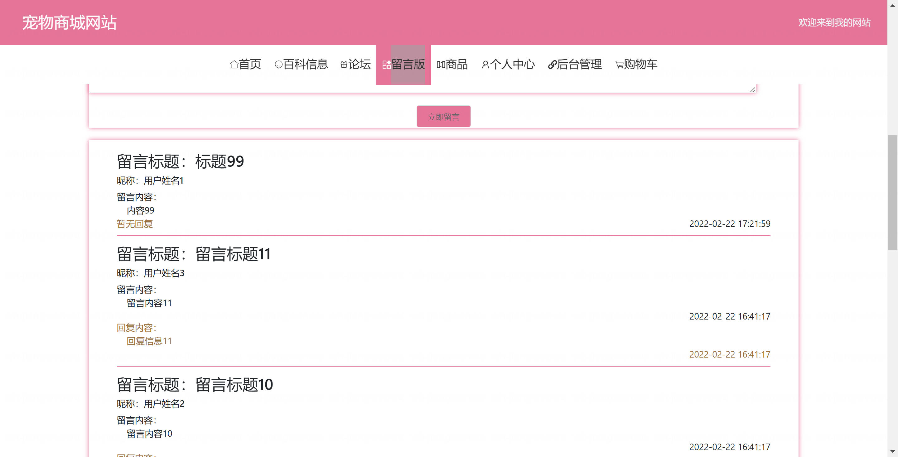
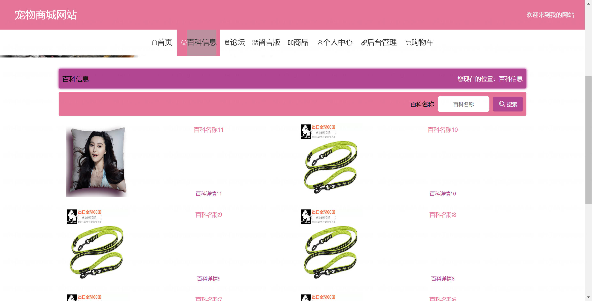
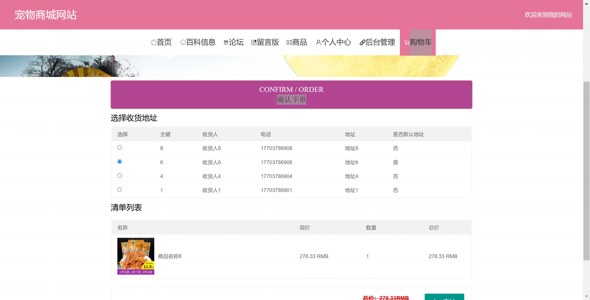
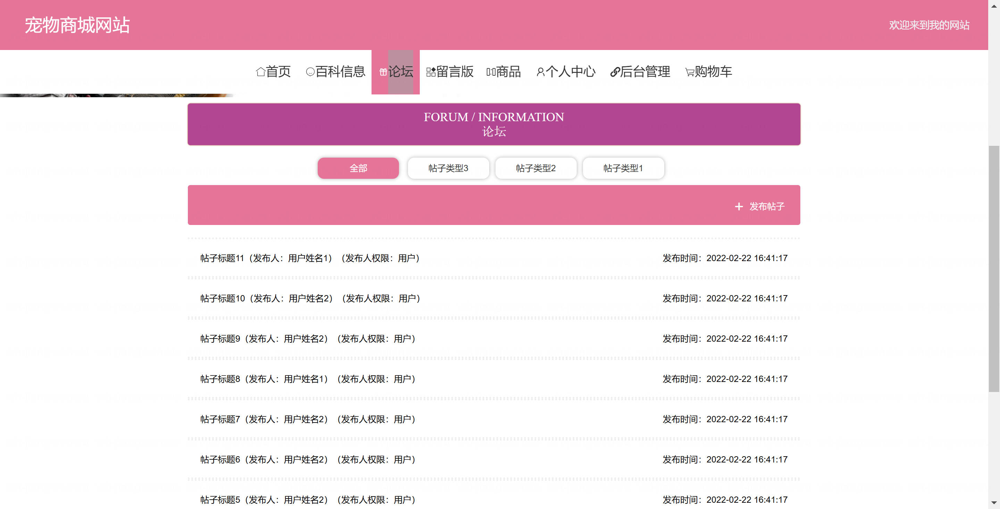
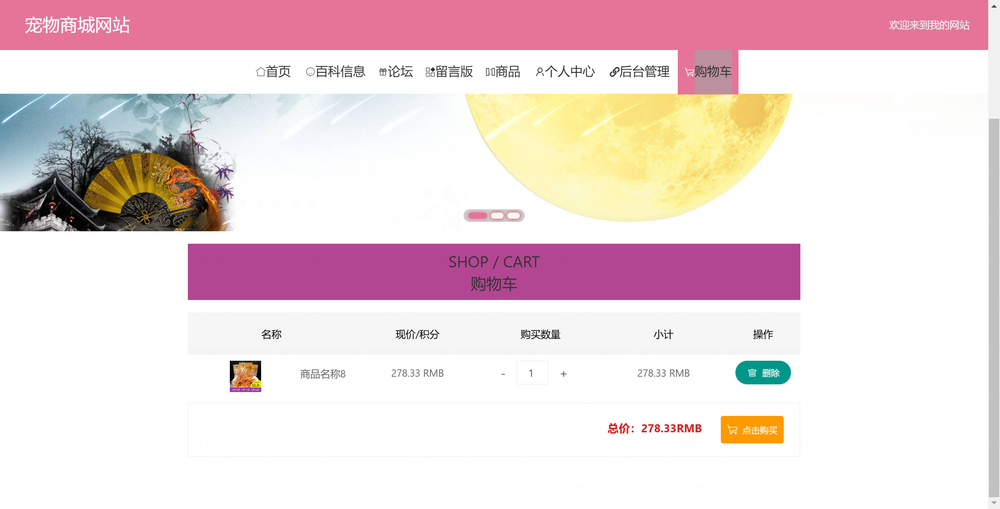

<h1 align="center">基于SpringBoot+Vue的宠物商城网站【带论文】</h1>

- <b>完整代码获取地址：从戎源码网 ([https://armycodes.com/](https://armycodes.com/))</b>
- <b>技术探讨、资料分享，请加QQ群：692619798</b>
- <b>作者微信：19941326836  QQ：3645296857</b>
- <b>承接计算机毕业设计、Java毕业设计、Python毕业设计、深度学习、机器学习</b>
- <b>选题+开题报告+任务书+程序定制+安装调试+论文+答辩ppt 一条龙服务</b>
- <b>所有选题地址 ([https://github.com/Descartes007/allProject](https://github.com/Descartes007/allProject)) </b>

## 一、项目介绍

基于SpringBoot+Vue的宠物商城网站，系统角色为管理员、用户，主要功能如下
### 管理员：
- 基本操作：登录、退出、修改密码、获取个人信息、修改个人信息
- 系统配置管理：查看/修改系统参数、站点与展示配置
- 管理员账户管理：新增管理员、重置密码、查询列表、删除、查看详情
- 前台用户管理：筛选用户、查看详情、重置密码、修改信息、删除、余额与积分/会员等级调整
- 商品管理：筛选商品、查看详情、新增商品、修改商品、逻辑删除、上下架
- 订单管理：筛选订单、查看详情、发货、收货、删除
- 商品评论管理：查看评论、回复评论、删除评论
- 商品收藏管理：查看收藏列表、取消收藏
- 购物车管理：查看购物车列表、修改数量、删除条目
- 收货地址管理：查看地址、设置默认地址、增删改查
- 百科管理：发布百科、筛选、查看详情、增删改查
- 论坛管理：筛选帖子、查看详情、修改状态（审核）、删除帖子
- 留言管理：查看留言、回复、删除
### 用户：
- 基本操作：注册、登录、退出、修改个人信息、重置密码、查看个人信息
- 商品浏览：商品列表、商品详情、搜索、点击统计
- 购物车：加入购物车、修改数量、移除条目、查看购物车列表
- 收货地址：新增地址、修改、删除、设置默认地址、查看列表
- 下单与支付：立即购买/购物车下单、余额支付、按会员等级折扣结算
- 订单管理：查看订单列表、查看订单详情、确认收货、申请退款、评价订单
- 收藏与评论：商品收藏/取消收藏、发表商品评价
- 论坛与留言：发布帖子、评论/回复、查看帖子，提交留言

## 二、项目技术

- 编程语言：Java
- 项目架构：B/S 架构
- 前端技术：Vue 2.x、Element-UI、Vue Router、Axios、Quill 编辑器
- 后端技术：Spring Boot 2.2、MyBatis、MyBatis-Plus、Fastjson、Hutool、MySQL

## 三、运行环境

- JDK版本：1.8及以上都可以
- 操作系统：Windows7/10、MacOS
- 开发工具：IDEA、Ecplise、MyEclipse都可以

## 四、数据库配置文件

- npm版本：6.14.13及以上都可以
- Redis版本：3.2.100及以上都可以
- 文件名：application.yml
- 编码类型：utf8

## 论文截图

## 系统截图

